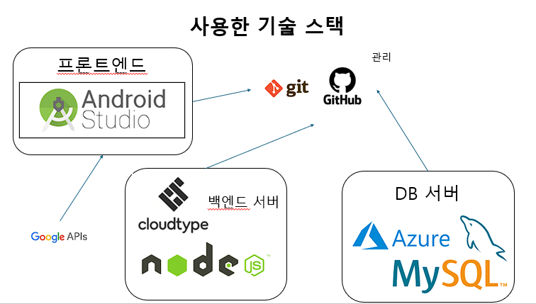
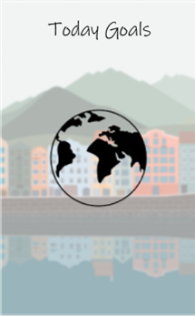
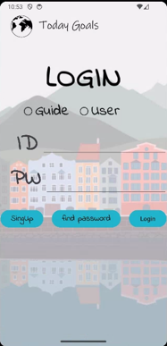
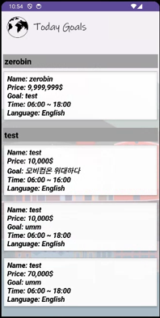
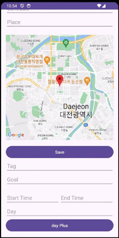
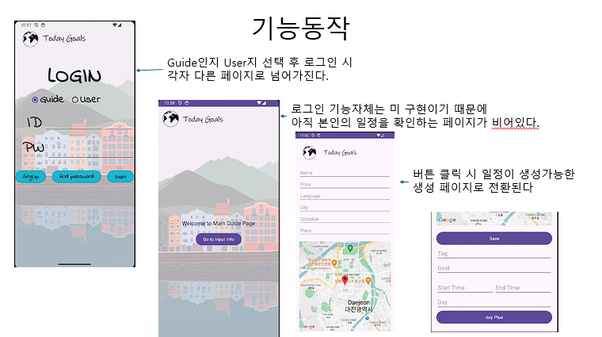
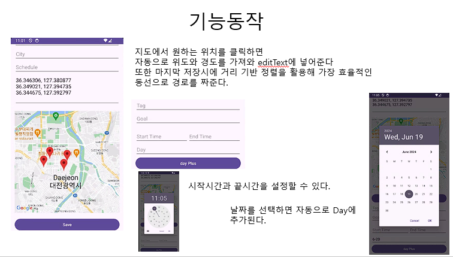
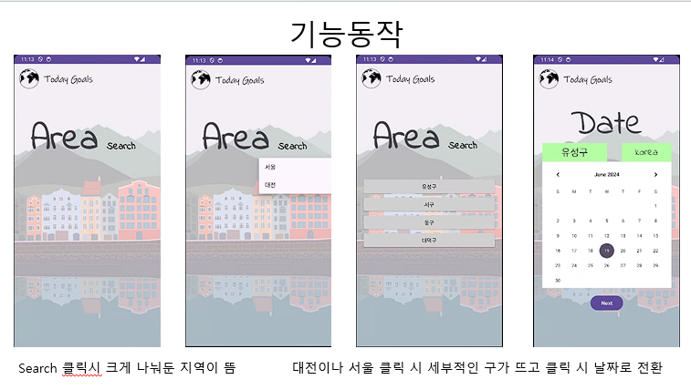
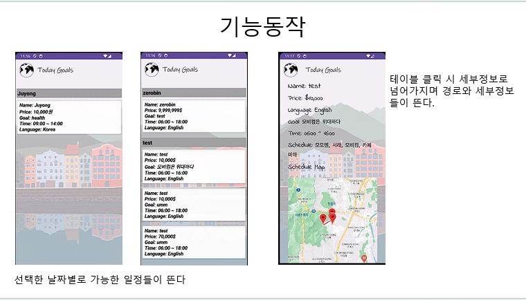

# Goals_project

# 앱 소개
<h2>Before</h2>
<td>
  <tl>자유여행을 좀 더 유익하게 즐길 순 없을까?</tl>
  <tl>패키지 여행은 너무 피곤한데?</tl>
  <tl>역사적인 것 말고 이 나라의 현대 문화 같은 걸 더 느껴보고 싶은데...</tl>
</td>

<h2>After</h2>
<td>
  <tl>그럼 자유여행 도중에 하루만 패키지를 해보면 어떨까?</tl>
  <tl>패키지 여행처럼 딱딱하게 말고 현지 학생들이 가이드를해보는 건 어떨까?</tl>
</td>

<h2>Result</h2>
<td>
  <tl>일일 패키지 여행 앱</tl>
</td>

<h2>사용한 기술 스택</h2>

<h2>디자인</h2>

<h2>기능 설명</h2>

